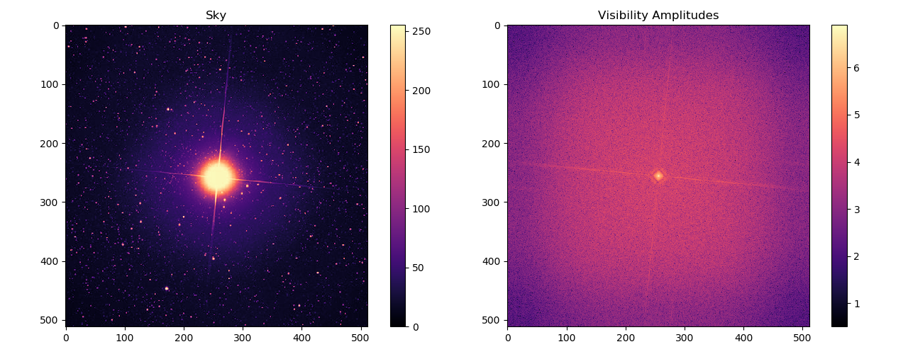
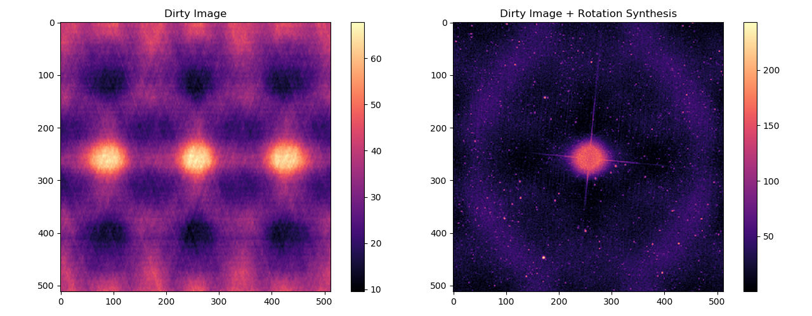
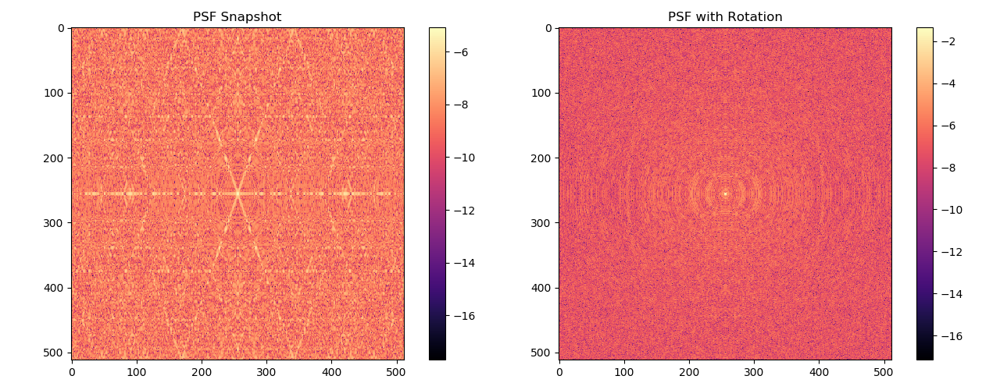
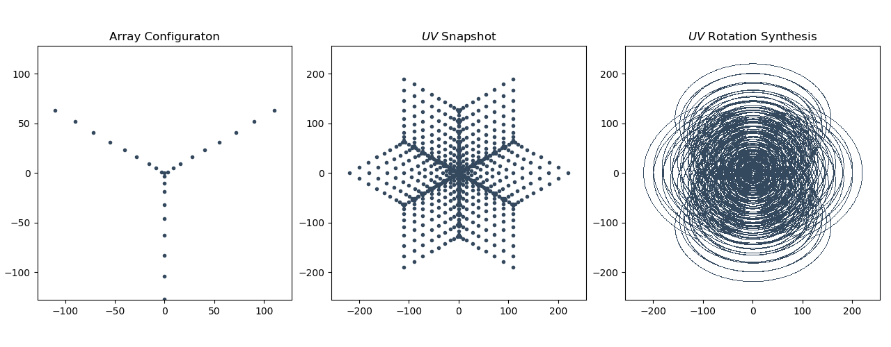

## Imaginary Interferometer
A simulated radio interferometer to build an intuitive understanding of the functioning of large radio interferometric arrays.

### Theory

Let the following image [left] of a star field be our "sky" for the purpose of this excercise.

The dirty images produced by the imaginary interferometer, with and without rotation synthesis.

The PSF (Point Spread Function) of the array with and without rotation synthesis.

Array configuration, UV sampling instantaneous snapshot, and UV sampling with rotation synthesis.

### Installation

This code required Python 3.0 or higher. First create a new virtual environment and install all required libraried there.
